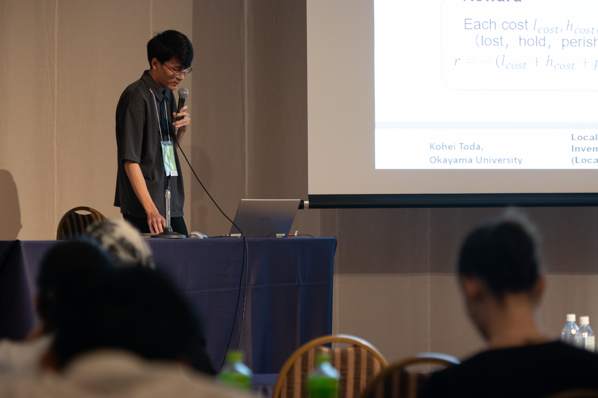

M1の遠田さんがAPMS 2025にて発表を行いました．

関連論文は以下の通りです．

- K. Toda, T. Nishi, and Z. Liu, “Local explanation method for ordering policy in perishable inventory management problem using LLM and LIME,” in IFIP Advances in Information and Communication Technology, Eds. Cham: Springer Nature Switzerland, 2026, pp. 289–302.
<!-- - M. S. Akter, T. Nishi, and Z. Liu, “A multi-period multi-objective model for sustainable supply chain optimization using MILP framework,” in IFIP Advances in Information and Communication Technology, Cham: Springer Nature Switzerland, 2026, pp. 303–319. -->

<!-- {width=50%} -->

